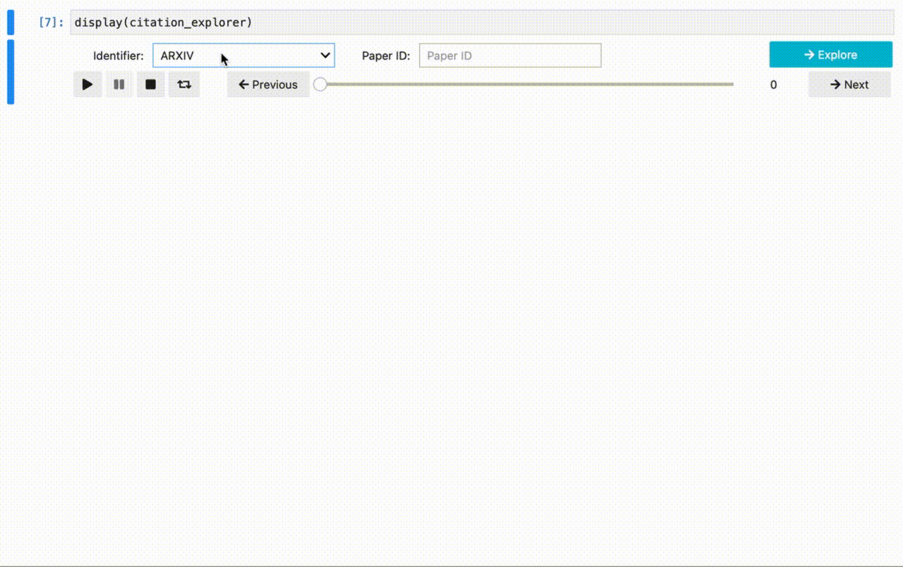

# Interactive Citation Exploration Widget

Interactive Widget for Exploring Citations of Academic Papers. 
Enter the ID of a paper in the widget and interactively explore the papers that cite it!

For instance, here's a little example of using it to explore the citations of the [TensorLy](http://tensorly.org/stable/index.html) [paper](http://jmlr.org/papers/v20/18-277.html):

Uses the awesome [Jupyter Widgets](https://ipywidgets.readthedocs.io/en/latest/) and [Semantic Scholar API](https://api.semanticscholar.org/graph/v1#operation/get_graph_get_paper_authors). 

Bonus: I got the Twitter markdown button in the notebook from [this gist](https://gist.github.com/kenmori/17e1122d5394251533933673a08f6a78). 
